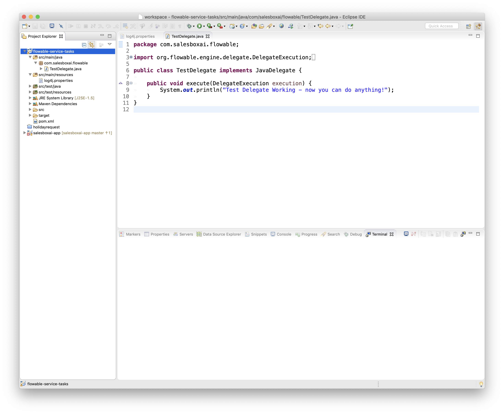

# Flowable Service Tasks

## Problem

We need a way to add service tasks to a flowable docker container.

## Way

Add service tasks to this repository (under `com.salesboxai.flowable`) and then run the `build.sh` to rebuild `flowable-tasks.war` and create a new docker image called `flowable`.

### Example

This repository is an eclipse project populated with a test Flowable Service that does nothing but print out a message when invoked.



Now we build the new Docker image

```sh
$ ./build.sh
```

Then we run the flowable and we’re done!

```sh
$ ./run.sh
```

## Demo

See the [demo video](https://youtu.be/Jm_p23FImwE).

## Setting JDBC

By default the docker image uses the in-memory `h2` database. This can be overridden by setting the `application.properties` file contained in this repo.